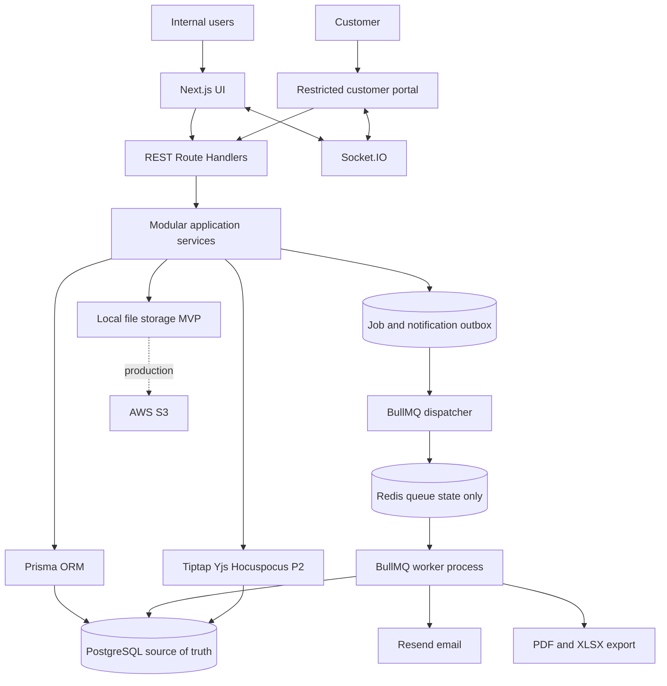
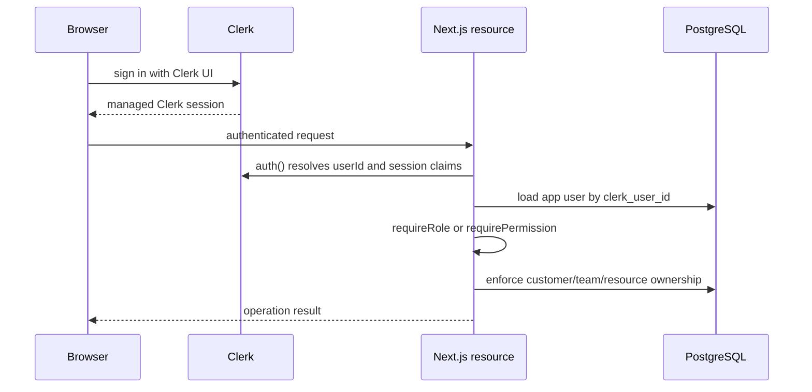
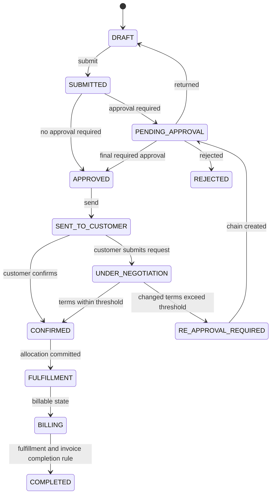
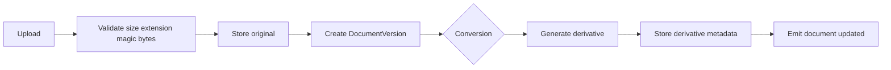
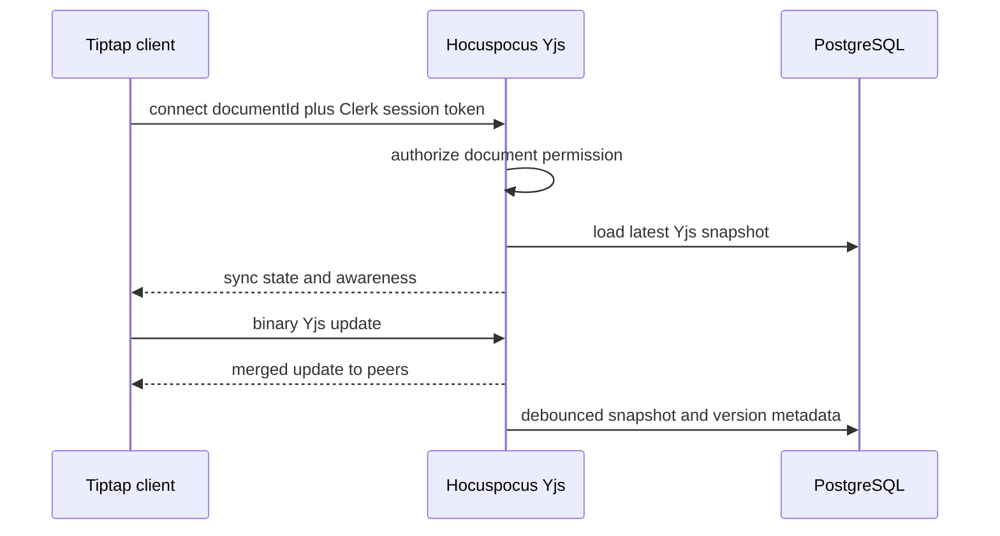
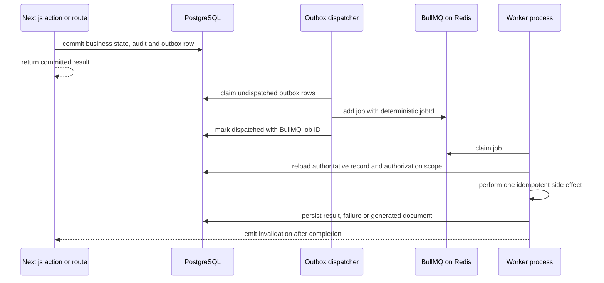
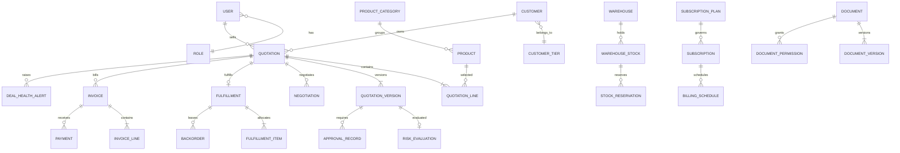
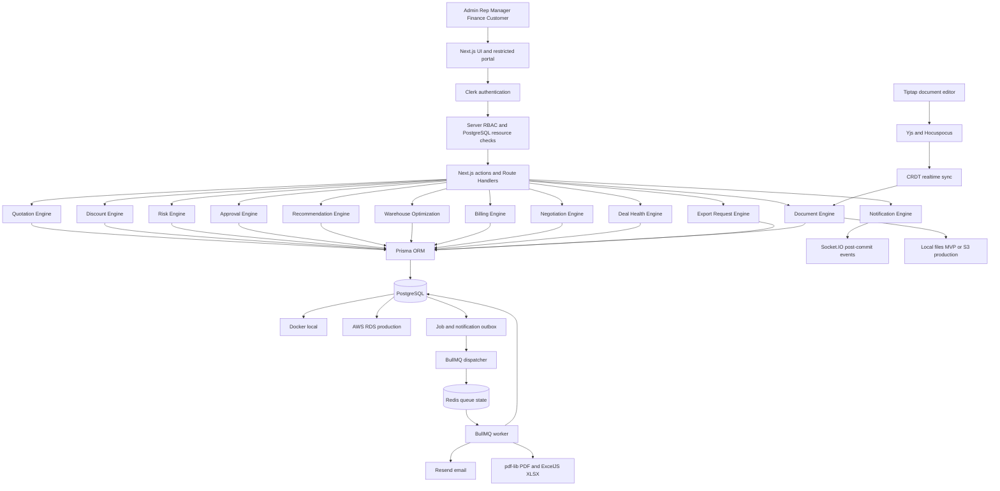

# DealFlow360 Technical Architecture Document

**Status:** Implementation proposal  
**Constraint:** 15-hour hackathon  
**Primary source:** DealFlow360 Product Specification  
**Architecture:** Next.js modular monolith with PostgreSQL as source of truth

## Decision notation

| Tag | Meaning |
|---|---|
| **PS REQUIREMENT** | Explicit behavior from the Product Specification. |
| **ARCHITECTURAL DECISION** | A technical choice needed to implement the PS or this TAD brief. |
| **HACKATHON SHORTCUT** | Deliberate 15-hour simplification with a known limitation. |
| **FUTURE PRODUCTION ENHANCEMENT** | Deferred hardening or scale work. |

## 1 Project context

**PS REQUIREMENT.** DealFlow360 is a B2B Sales Operations and quote-to-cash platform. Its value is the connected workflow: quotation, discount governance, blended risk, automatic approval, guided selling, inventory-aware fulfillment, hybrid billing, customer negotiation, re-approval, payment, deal health, and reporting. Core rules run in backend application logic; the demo must not fake them.

## 2 Hackathon objective and boundaries

The team should optimize for a repeatable end-to-end demo, correct business rules, transaction safety, and a responsive UI. Use one application codebase, one PostgreSQL database, and one separate BullMQ worker process from the same codebase. Do not add microservices, Kubernetes, Kafka, GraphQL, event sourcing, or a real payment gateway. Redis is permitted only as BullMQ infrastructure; it is not a business database or general application cache.

The critical path is quotation to payment. File conversion and collaboration are isolated feature flags. A failure in Socket.IO, email, conversion, or collaboration must not roll back or corrupt a committed commercial transaction.

## 3 Fixed technology stack

| Layer | Choice | Classification |
|---|---|---|
| UI | Next.js App Router, React, TypeScript, Tailwind CSS, shadcn/ui | Fixed |
| Forms | React Hook Form plus shared Zod schemas | Fixed |
| Backend | Next.js Route Handlers and Node.js services | Fixed |
| Authentication | Clerk Next.js SDK for authentication; server-enforced role and resource authorization | Architectural decision |
| Database | PostgreSQL in Docker locally; AWS RDS for PostgreSQL in production | Fixed |
| ORM | Prisma ORM, pinned to one tested version | Architectural decision |
| Realtime | Socket.IO for application events | Fixed |
| Email | Resend HTTP API behind a provider interface | Architectural decision |
| Worker jobs | BullMQ with Redis; PostgreSQL outbox for durable dispatch intent | Architectural decision |
| Reporting | Recharts, `pdf-lib` for PDF, and ExcelJS for XLSX | Fixed plus design |
| Collaboration | Tiptap plus Yjs and Hocuspocus, time-boxed | Architectural decision, P2 |
| Deployment | Single Dockerized Node process on AWS plus RDS | Fixed boundary |

Prisma is an ORM and migration/data-access tool; PostgreSQL remains the database. Current Prisma documentation supports PostgreSQL, Next.js, transactions, idempotent operations, and optimistic concurrency. Pin Node, Next.js, Prisma, and lockfile versions at project start rather than upgrading during the hackathon.

## 4 System architecture



Use the Node.js runtime for all stateful routes and the worker because PostgreSQL drivers, BullMQ, file libraries, Socket.IO, and Hocuspocus require full Node APIs. Server Components may query services directly for initial reads; REST Route Handlers own external/webhook APIs, while application services own business rules. This follows current [Next.js Route Handler guidance](https://nextjs.org/docs/app/getting-started/route-handlers).

## 5 Persistence and realtime rule

PostgreSQL is authoritative. Every command follows:

1. Authenticate with Clerk and authorize the role, permission, and resource scope in the backend.
2. Validate input and current aggregate version.
3. Execute domain logic inside a database transaction where multiple writes form one business operation.
4. Commit state, audit record, and optional outbox job in the same PostgreSQL transaction.
5. Dispatch the outbox item to BullMQ after commit using a deterministic job ID.
6. Let an idempotent worker perform email, report export, conversion, or recalculation and persist its result.
7. Emit Socket.IO invalidation after commit or worker completion; failure never reverses the business result.

Socket.IO rooms and delivery are transient. Socket.IO preserves ordering for received messages but defaults to at-most-once delivery, so a reconnecting client must refetch authoritative state rather than trusting missed events ([Socket.IO delivery guarantees](https://socket.io/docs/v4/delivery-guarantees)).

## 6 Roles and permissions

| Capability | Admin | Sales Rep | Manager | Finance or Ops | Customer |
|---|---:|---:|---:|---:|---:|
| Configure products, price lists, warehouses, plans | Yes | No | No | Operational stock only | No |
| Configure discount tiers and approval chain | Yes | No | Yes | No | No |
| Create and revise assigned quotations | No by default | Yes | Read | Read | Request changes only |
| Manager approval | No by default | No | Yes | No | No |
| Finance approval | No by default | No | No | Yes | No |
| Accept or override fulfillment split | No by default | Track | Read | Yes | No |
| Manage billing and record payment | No by default | Track | Read | Yes | No |
| Negotiate and confirm | No | Respond | Read | Read | Own quotation only |
| Platform reporting | Yes | Assigned scope | Team scope | Operational scope | No |
| Document access | By associated record and permission | Assigned records | Team/routed records | Operational records | Explicit own-customer permission |

Frontend route hiding is convenience only. Every Server Action, Route Handler, Socket.IO join, and BullMQ job entry point calls the shared `authorize(actor, action, resource)` policy after Clerk authentication. Customer authorization always includes `resource.customerId === actor.customerId`; IDs supplied by the browser or job payload never establish ownership.

## 7 Clerk authentication and RBAC architecture



Use `@clerk/nextjs`, place `ClerkProvider` inside the root `<body>`, and install `clerkMiddleware()` in `proxy.ts` for Next.js 16+ or `middleware.ts` for Next.js 15 and earlier. `auth()` is asynchronous. Middleware establishes Clerk context, but authorization stays next to each protected resource rather than depending on path matching alone.

For the 15-hour MVP, store one of `ADMIN`, `SALES_REP`, `MANAGER`, `FINANCE_OPS`, or `CUSTOMER` in Clerk `publicMetadata.role`, set only through trusted server/admin tooling, and expose it through a custom session claim. The PostgreSQL `users` row is keyed by unique `clerk_user_id` and mirrors the role and optional `customer_id` for joins and audit history. A Clerk webhook or explicit seed/sync command updates that mirror. Reject missing, unknown, or mismatched roles; never accept a role from form data or client state.

The claim is a fast role hint, not proof that a user owns a deal. `requireRole()` or `requirePermission()` checks the server-side claim, then `authorize()` loads the current app user and applies team, assignment, document permission, and customer ownership constraints from PostgreSQL. Sensitive role changes update Clerk and PostgreSQL through one admin use case with audit and reconciliation. Production may adopt Clerk Organizations custom roles/permissions; resource ownership remains in PostgreSQL. Clerk owns passwords, sessions, sign-in, sign-out, recovery, and optional MFA, so DealFlow360 stores no password hash or refresh token.

## 8 Modular monolith modules

| Module | Responsibility and owned data | Main services and APIs | Events | Dependencies |
|---|---|---|---|---|
| Authentication | Clerk identity/session integration and webhook sync | Clerk adapter; `/api/webhooks/clerk` | `user:synced` | Users |
| Users and Roles | App identity mirror, roles, permissions and resource policies | UserService, AuthorizationService | none | Clerk |
| Customers | Buyer and ownership boundary | CustomerService | `customer:updated` | Tiers |
| Customer Tiers | Tier prices and ceilings | TierService | `rules:updated` | Discounts |
| Products | Sellable items and variants | ProductService | `product:updated` | Categories |
| Product Categories | Classification and category ceiling | CategoryService | `rules:updated` | Products |
| Price Lists | Tier/currency prices | PricingService | `pricing:updated` | Products, Tiers |
| Discount Rules | Tier/category ceilings | DiscountRuleService | `rules:updated` | Pricing |
| Quotations | Aggregate, lines, versions, lifecycle | QuotationService; `/api/quotations` | `quotation:*` | Pricing, Risk |
| Discount and Risk | Deterministic evaluation | RiskService | `quotation:risk-updated` | Rules, Margin |
| Approval | Automatic chain and decisions | ApprovalService | `approval:*` | Risk, Audit |
| Recommendations | Explainable top-K products | RecommendationService | `recommendation:updated` | Products, Margin, Stock |
| Warehouses | Warehouse configuration | WarehouseService | `warehouse:updated` | Admin |
| Stock | Availability and reservations | StockService | `stock:updated` | PostgreSQL transaction |
| Fulfillment | Suggested and manual allocations | FulfillmentService | `fulfillment:updated` | Stock, Optimizer |
| Backorders | Remaining demand and consolidation | BackorderService | `backorder:updated` | Fulfillment |
| Subscription Plans | Cadence and adjustment rules | PlanService | `plan:updated` | Products |
| Subscriptions | Customer recurring commitments | SubscriptionService | `subscription:updated` | Plans |
| Billing | One-time and recurring calculation | BillingService | `billing:updated` | Subscriptions |
| Invoices | Billing documents and status | InvoiceService | `invoice:updated` | Billing |
| Payments | Idempotent manual payment records | PaymentService | `payment:recorded` | Invoice, Audit |
| Negotiation | Comments, requests, counter terms | NegotiationService | `negotiation:*` | Quotation, Risk |
| Deal Health | Deterministic alerts | DealHealthService | `deal-health:updated` | Quotations, Fulfillment |
| Audit Trail | Immutable business evidence | AuditService | none | All mutations |
| Notifications | Outbox, Socket.IO, email | NotificationService | all external events | Outbox |
| Jobs | Durable dispatch and BullMQ processing | JobDispatcher, WorkerRegistry | `job:*` | Outbox, Redis |
| Files and Documents | Metadata, versions and association | DocumentService | `document:updated` | Filesystem/S3 |
| Collaborative Editing | Yjs rooms and snapshots | CollaborationService | `document:presence` | Documents |
| Reporting | Aggregated queries and chart DTOs | ReportService | none | Core tables |
| Export | PDF/XLS/CSV generation | ExportService | `export:ready` | Reporting, Documents |

Modules may read another module through its service interface. Route handlers do not write Prisma models directly. Cross-module circular calls are avoided by orchestrators such as `SubmitQuotationUseCase` and `ConfirmNegotiationUseCase`.

### Module business rules

| Module | Enforced rule |
|---|---|
| Authentication | A valid Clerk session identifies the actor; absent or invalid sessions are rejected. |
| Users and Roles | Clerk claims provide the role hint; backend policy and PostgreSQL ownership checks remain mandatory. |
| Customers | Portal queries always constrain both resource ID and authenticated customer ID. |
| Customer Tiers | Tier configuration feeds pricing and discount limits; Bronze/Silver/Gold are seed examples. |
| Products | Only active products/variants with resolvable prices can enter a submitted quote. |
| Product Categories | Category ceiling participates in per-line discount evaluation. |
| Price Lists | Resolve a deterministic price by customer tier and currency; overlap is rejected by configuration validation. |
| Discount Rules | Use the configured tier/category ceiling and preserve the evaluated rule version. |
| Quotations | Only the state machine can change lifecycle; every commercial edit increments version. |
| Discount and Risk | Evaluate all lines and the blended pattern; return a component explanation. |
| Approval | Create the chain automatically; manager precedes Finance; decisions target one quote version. |
| Recommendations | Exclude below-margin candidates; every score is explainable. |
| Warehouses | Configuration supplies stock, replenishment, shipping cost and delivery inputs. |
| Stock | Never reserve more than available; reserve inside a transaction. |
| Fulfillment | Suggested or manual plans must pass the same stock feasibility validation. |
| Backorders | Persist unfilled quantity and reevaluate consolidation when stock arrives. |
| Subscription Plans | Cadence is monthly, quarterly or yearly; proration/cancellation rules are configured. |
| Subscriptions | Mid-cycle changes create an adjustment and revised schedule rather than mutating history silently. |
| Billing | One-time and recurring lines share an order but receive separate billing treatment. |
| Invoices | Status derives from issued amount, payments and credits; direct arbitrary status writes are forbidden. |
| Payments | Record manually and idempotently; no real gateway is part of MVP. |
| Negotiation | Accepted changed terms create a new quote version and re-run margin/risk/approval. |
| Deal Health | MVP rules are deterministic, configurable and stored with explanations. |
| Audit Trail | Approval, rejection and edit evidence includes actor, timestamp, state change and reason. |
| Notifications | Database commit precedes Socket.IO/email; provider failure cannot undo business state. |
| Jobs | Payloads contain identifiers, not authoritative snapshots; workers reload state and are retry-safe. |
| Files and Documents | Bytes remain outside PostgreSQL; metadata, access and versions remain inside it. |
| Collaborative Editing | Yjs resolves text conflicts; authorization is checked before joining a document room. |
| Reporting | Queries honor the actor's data scope and use the same persisted state as operational screens. |
| Export | Export reflects the selected filters and never bypasses report authorization. |

## 9 Quotation engine

`Quotation` is the aggregate root. `QuotationVersion` freezes commercial terms each time the quote is submitted or customer negotiation changes terms. Approval records target a version, preventing an old approval from authorizing new terms.



Invalid transitions return `409 INVALID_STATE_TRANSITION`. Mutations require `expectedVersion`; successful mutation increments `quotation.version`. `COMPLETED` requires all fulfillment items delivered or accepted as resolved and all required invoices paid or credited. That completion rule is an architectural decision because the PS does not define it.

## 10 Discount and blended risk engine

**PS REQUIREMENT.** Evaluate every line against customer-tier and category limits; consider the pattern across all lines; route to the highest required approval. The PS does not mandate a formula.

**ARCHITECTURAL DECISION.** For the MVP, calculate a transparent configurable score. If both tier and category ceilings exist, use the lower ceiling. Combine line and order discount sequentially:

```text
effectiveDiscount = 1 - (1 - lineDiscount) * (1 - orderDiscount)
excess_i = max(0, effectiveDiscount_i - allowedDiscount_i)
valueWeight_i = lineNetBeforeTax_i / quoteNetBeforeTax
weightedExcess = sum(valueWeight_i * excess_i)
violationBreadth = sum(valueWeight_i where excess_i > 0)
maxExcess = max(excess_i)
marginPressure = max(0, (configuredMinMargin - quoteMargin) / configuredMinMargin)
riskScore = 100 * clamp(
  w1*normalize(weightedExcess) +
  w2*violationBreadth +
  w3*normalize(maxExcess) +
  w4*marginPressure,
  0, 1)
```

Store weights, normalizers, and thresholds in configuration. Any line violation forces at least manager approval. `financeThreshold` determines the second level. A quotation with no violation may still require approval if an order-level configured rule or margin rule triggers. Persist a `risk_evaluation` JSON explanation containing allowed limit, effective discount, excess, value weight, and component contributions for each line.

Gold example: Laptop at 12% against 15% has zero excess. Setup Service at 18% against 10% has 8 percentage points excess, so the quotation is flagged. The score reflects both the service violation and its value share; several small violations increase `weightedExcess` and `violationBreadth`.

## 11 Approval engine

Risk band mapping is configuration: LOW -> no approval; MEDIUM -> manager; HIGH -> manager then Finance. On submission, create ordered `approval_records` for the current `quotation_version_id`. Only the first pending step is actionable.

Approve, Reject, and Return execute a conditional update where record status is `PENDING` and version matches. Each transaction updates the record and quotation state and inserts an audit row. A second reviewer receives `409 APPROVAL_ALREADY_ACTIONED`. Finance cannot act before manager approval. Reject is terminal for that version; Return creates a revision path to Draft.

## 12 Customer negotiation

The portal uses the Clerk user identity plus PostgreSQL customer ownership checks. Comments do not mutate terms. A change request or counter-discount creates a negotiation item. When accepted terms are applied, one transaction creates a new quotation version, recalculates price, margin, and risk, invalidates prior-version approval applicability, creates a new chain when needed, and writes audit records. The post-commit event is `negotiation:updated`; if approval is required, also emit `approval:created`.

## 13 Warehouse optimization

For each order line, normalize coverage, shipping cost, delivery days, split penalty, and backorder risk. Higher is better:

```text
score(w, remaining) =
  a * min(stock_w, remaining) / remaining
  + b * isSingleSource(stock_w >= remaining)
  - c * normalizedShippingCost_w
  - d * normalizedDeliveryDays_w
  - e * normalizedBackorderRisk_w
```

Evaluate direct single-source plans and a heap-driven greedy split; choose the feasible plan with the lowest final objective after recomputing shipment count and total cost. This prevents always choosing Warehouse C merely because it has 100 units when A plus B is materially cheaper.

```text
allocate(line, warehouses, weights):
  candidates = eligible warehouses with available stock
  directPlans = each warehouse that can fill the entire quantity
  heap = maxHeap(score(candidate, remaining), candidate)
  plan = []
  while remaining > 0 and heap not empty:
      w = heap.pop()
      qty = min(w.available, remaining)
      plan.add(w, qty)
      remaining -= qty
      recompute affected candidate scores and heap priorities
  if remaining > 0: create proposed backorder(remaining)
  compare objective(plan) with every directPlan
  validate allocations against current stock
  reserve chosen plan inside one PostgreSQL transaction
  return allocations, backorder, explanation
```

Manual override runs the same feasibility and reservation validation. Partial fulfillment creates a backorder. When stock changes for a backordered product, evaluate consolidation and show the PS-required prompt.

## 14 Stock consistency

Lock stock rows in deterministic `(warehouse_id, product_id)` order inside one transaction:

```sql
SELECT id, available_qty, reserved_qty
FROM warehouse_stock
WHERE (warehouse_id, product_id) IN (...)
ORDER BY warehouse_id, product_id
FOR UPDATE;
```

Revalidate availability after locking, insert `stock_reservations`, increment reserved quantity with `CHECK (available_qty >= reserved_qty)`, create fulfillment items/backorder, and commit. Any failure rolls back all writes. For a single reservation, an atomic conditional update is sufficient. `UNIQUE(fulfillment_id, product_id, warehouse_id)` and an idempotency key prevent duplicates.

## 15 Upsell and cross-sell engine

Use deterministic weighted scoring, never an LLM:

```text
score = alpha*coPurchase + beta*promotion + gamma*margin
      + delta*compatibility + epsilon*availability + zeta*tierAffinity
```

Normalize components to `[0,1]`; store weights in `recommendation_config`. Exclude products already in the quote, incompatible products, inactive products, and candidates below the minimum margin. Return `reasonCodes`, promotion, and projected margin delta. After Add to Quote, recalculate price, margin, recommendations, and risk. For small candidate sets, sort descending. Use a size-k min-heap only when the catalog is large enough that top-K selection matters.

## 16 Heap and priority queue use

| Use | Structure | Complexity | Expected size | Decision |
|---|---|---|---:|---|
| Warehouse ranking | Max heap of eligible warehouses | heapify `O(n)`; pop/update `O(log n)` | 2-50 | Useful when scores change as remaining demand changes. |
| Recommendation top-K | Min heap of best K | `O(n log k)` time, `O(k)` space | 10-10,000 candidates | Use only beyond a simple-sort threshold. |
| Approval queue | Database `ORDER BY`, not in-memory heap | indexed query `O(log n + k)` | many persistent rows | Sorting/querying is simpler and survives restarts. |
| Deal-health alerts | Database priority column and index | indexed top-K | many persistent alerts | Do not keep authoritative alerts in a heap. |

## 17 Configurable benefit and loss scoring

Create a shared pure TypeScript scoring utility with named normalized components and versioned configuration. Benefit components are revenue, gross margin, retention proxy, upsell opportunity, fulfillment efficiency, approval speed, and conversion proxy. Loss components are excessive discount, margin erosion, shipping cost, shipment count, backorder risk, delivery slippage, approval risk, recommendation risk, and churn proxy.

The utility produces `{score, configVersion, components, explanation}`. It supports ranking and UI explanation, not autonomous commercial decisions. Approval remains governed by explicit rules.

## 18 File and document management

`Document` stores metadata and association; `DocumentVersion` stores immutable version metadata and a storage key. Bytes stay on local filesystem for the local MVP and S3 in production, never in PostgreSQL.

Recommended server-side libraries: `file-type` for magic-byte detection, `sharp` for images, `exceljs` for XLSX, `csv-parse` and `csv-stringify` for CSV, `docx` for DOCX generation, Mammoth for best-effort DOCX text/HTML extraction, `pdf-lib` for PDF creation/modification, and `pdfjs-dist` for PDF previews. `pdf-lib` does not promise general page-text extraction or HTML/CSS rendering, so do not use it as a universal converter ([pdf-lib limitations](https://github.com/Hopding/pdf-lib)).

## 19 File conversion architecture



| Conversion | MVP support | Implementation | Fidelity |
|---|---|---|---|
| XLSX -> CSV | Full for selected worksheet | ExcelJS plus CSV writer | Values only; styles/formulas may be lost. |
| CSV -> XLSX | Full | CSV parser plus ExcelJS | Basic workbook, no inferred complex formatting. |
| TXT -> preview | Full | escaped text | Exact text. |
| Images -> thumbnails | Full | Sharp | Controlled resize. |
| PDF -> preview | Full | browser/pdfjs rendering | Visual preview, not editing. |
| DOCX -> TXT/HTML | Partial | Mammoth | Semantic content; layout fidelity not guaranteed. |
| DOCX -> PDF | Future or external | LibreOffice/service in production | High fidelity cannot be promised in-process. |
| PDF -> editable DOCX | Future external service | Specialized conversion provider | Explicitly lossy. |

## 20 Realtime collaborative editing decision

Use Socket.IO for business events. Do not build collaborative text synchronization directly on Socket.IO. Use Tiptap as editor, Yjs as the mature CRDT, and Hocuspocus as a WebSocket synchronization server mounted in the same Node process. Hocuspocus is built on Yjs and supports collaborative text, awareness, and persistence hooks ([Hocuspocus documentation](https://tiptap.dev/docs/hocuspocus/getting-started/overview)). This specialized transport is an exception because CRDT binary update synchronization and awareness are distinct from application notifications.

## 21 Collaborative editing architecture



Identifiers: `documentId`, `userId`, random `sessionId`, and monotonic `versionId`. Yjs updates are binary; persist periodic merged snapshots in object/file storage and metadata/checksum in PostgreSQL. Autosave after 2 seconds idle or 30 seconds maximum. On reconnect, load snapshot then exchange missing state vectors. Presence is ephemeral and never authoritative. Hocuspocus authorization checks DocumentPermission before joining.

MVP scope is one rich-text document type, two-tab simultaneous editing, autosave, basic presence, and snapshot persistence. Exclude offline editing, DOCX-native collaboration, track changes, branching, and enterprise locking.

## 22 File security

Validate configured size, extension, and detected MIME; reject mismatches. Generate storage keys rather than trusting filenames, sanitize display names, prevent path traversal, store outside `public`, and authorize every download. Customer access requires both document permission and associated-record ownership. Use an allowlist for PDF, DOCX, XLSX, CSV, TXT, PNG, and JPEG. Quarantine untrusted uploads; MVP can mark malware scanning unavailable and limit files to demo seed/user files. Production scans with a managed scanner or ClamAV pipeline before release.

Local filesystem is acceptable only for local/single-instance hackathon use. Production uses S3 private objects and short-lived presigned URLs; AWS documents these as time-limited bearer access, so URLs must be protected and narrowly scoped ([AWS S3 presigned URLs](https://docs.aws.amazon.com/AmazonS3/latest/userguide/using-presigned-url.html)).

## 23 Realtime architecture

Rooms are server-authorized: `user:{id}`, `role:{role}`, `quotation:{id}`, `customer:{id}`, `warehouse:{id}`, `document:{id}`. Socket.IO rooms are server-only channels ([Socket.IO rooms](https://socket.io/docs/v4/rooms/)). The handshake resolves the Clerk session and app user; each join rechecks resource access.

| Event | Producer | Room | Payload |
|---|---|---|---|
| `quotation:created/updated` | Quotation service after commit | quotation, assigned user | id, version, state, changed fields |
| `approval:created/updated` | Approval service | approver user/role, quotation | approval id, quote id, status |
| `negotiation:created/updated` | Negotiation service | quotation, customer, rep | ids, status, version |
| `stock:updated` | Stock service | warehouse | product id, available summary |
| `fulfillment:updated` | Fulfillment service | quotation | fulfillment id, status |
| `invoice:updated` | Invoice service | quotation and authorized user | invoice id, status |
| `payment:recorded` | Payment service | quotation | payment id, invoice status |
| `deal-health:updated` | Deal health service | manager role | alert id, type, priority |
| `recommendation:updated` | Recommendation service | quotation | top-K ids and explanation codes |
| `document:updated/presence` | Document/collab service | document | version metadata or ephemeral presence |
| `export:queued/ready/failed` | Export API/worker | requesting user | export id, status, format; authorized URL only on refetch |

Payloads never contain secrets, full customer datasets, or unrelated quote details. Clients receiving an event refetch via REST. Redis is already present for BullMQ, but Socket.IO keeps its in-memory adapter for the single-instance MVP. A Redis Socket.IO adapter is a separate, later decision when horizontal realtime scale is demonstrated.

## 24 Email architecture

Nodemailer is a Node library; SMTP is a protocol/transport; Resend is a hosted delivery API that can also expose SMTP. Choose the Resend HTTP API for the hackathon because setup, typed SDK use, delivery visibility, and idempotency are simpler than operating arbitrary SMTP. Keep `EmailProvider` with `send(message, idempotencyKey)` so SMTP/Nodemailer can replace it. Resend also documents SMTP and Nodemailer integration, proving these choices are composable rather than exclusive ([Resend Nodemailer SMTP](https://resend.com/docs/send-with-nodemailer-smtp)).

Supported functions: quotation link, approval request/result, negotiation notification, confirmation, invoice, and payment receipt. The business transaction writes an outbox row; the dispatcher creates a BullMQ `email.send` job after commit. The worker reloads the outbox record, sends with its idempotency key, and records `SENT` or retryable `FAILED` status. The business operation remains committed and the UI shows notification status.

## 24A BullMQ worker architecture

BullMQ is used only for work that can happen after a committed business transaction: email delivery, PDF/XLSX report generation, allowlisted file conversions, and scheduled/batched deal-health evaluation. Approval decisions, quote versioning, stock reservation, invoice totals, and payment recording remain synchronous PostgreSQL transactions. BullMQ requires Redis, but Redis stores queue coordination and job state only; PostgreSQL remains the durable business source of truth.



Use separate queues such as `notifications`, `exports`, `conversions`, and `maintenance`, with named jobs and versioned, minimal payloads such as `{ outboxId, actorUserId, exportRequestId }`. Claim outbox batches with a short PostgreSQL transaction and `FOR UPDATE SKIP LOCKED`; a deterministic BullMQ `jobId` closes the crash window between queue insertion and marking an outbox row dispatched. Configure finite attempts, exponential backoff, per-job timeouts, concurrency limits, and removal/retention policies. Workers must be idempotent because BullMQ retries failures: use unique PostgreSQL idempotency keys, deterministic storage keys, and upserts/conditional status transitions. Do not put secrets, large report datasets, or file bytes in Redis.

The dispatcher uses a short-failing producer connection so an HTTP request never hangs on Redis. If Redis is unavailable, the committed outbox row remains `PENDING` and is dispatched later. Worker connections may wait and reconnect. A terminal failure is retained long enough for inspection, recorded in PostgreSQL with a sanitized reason, and can be requeued by an authorized admin. Health distinguishes `app/database healthy` from `queue degraded`; queue degradation does not authorize bypassing business rules.

## 25 Billing architecture

Classify each quotation line as `ONE_TIME` or `RECURRING`. Confirmation creates the billing plan: one-time lines become invoice lines; recurring lines create Subscriptions and BillingSchedules from monthly, quarterly, or yearly plans. Mid-cycle changes call the configured proration strategy. The PS does not define a formula, so seed one transparent day-based rule for the demo and label it configuration.

`recordPayment(invoiceId, amount, idempotencyKey)` creates a manual Payment and recalculates invoice status in one transaction. No gateway is needed. Statuses: `DRAFT`, `ISSUED`, `PARTIALLY_PAID`, `PAID`, `VOID`, `CREDITED`; only PAID is required by the requested demo.

## 26 Transaction management

| Operation | Atomic writes | Failure behavior |
|---|---|---|
| Submit quotation | version snapshot, risk result, approval chain or state, audit, outbox | Roll back all; quote stays Draft. |
| Approval action | conditional approval update, quote state, audit, outbox | Roll back; retry conflict returns 409. |
| Negotiation acceptance | negotiation, quote version, totals, risk, approvals/state, audit, outbox | Roll back all changes. |
| Stock allocation | row locks, reservations, fulfillment items, backorder, audit, outbox | Release locks and roll back. |
| Payment | unique idempotency record, payment, invoice totals/status, audit, outbox | No partial payment record. |
| Subscription change | new schedule/adjustment, refund or credit note, audit, outbox | Existing schedule remains. |

Use Prisma interactive transactions with short timeouts. Do not call email or Socket.IO inside the transaction. Prisma documents transactions, serializable isolation, optimistic concurrency, and retryable write conflicts ([Prisma transactions](https://www.prisma.io/docs/orm/v6/prisma-client/queries/transactions)).

## 27 PostgreSQL database design

All tables use UUID primary keys, `created_at`, `updated_at`, and business-aggregate `version` where concurrent edits matter. Money uses `numeric(14,2)` plus currency; percentages use `numeric(7,4)` representing decimal fraction; timestamps use `timestamptz`.

| Table | Important columns and constraints |
|---|---|
| users, roles | unique `clerk_user_id`; normalized email for display/search; role FK; customer FK nullable; active/sync status |
| customers, customer_tiers | tier FK; unique tier name |
| product_categories, products, product_variants | category FK; unique SKU; nonnegative prices |
| price_lists, price_list_items | tier/currency; unique `(price_list_id, product_id, variant_id)` |
| discount_rules, approval_rules | scope, ceiling, risk bands, effective status; checked percentage bounds |
| quotations, quotation_lines, quotation_versions | customer/rep FKs; lifecycle; version; immutable version payload/hash |
| risk_evaluations | quotation version FK unique; score, band, explanation JSONB, config version |
| approval_records | quote version, step, role, status, actor, reason; unique version/step |
| audit_logs | actor, role, entity type/id, action, before/after JSONB, reason, timestamp |
| warehouses, warehouse_stock, stock_reservations | unique warehouse/product; quantities with checks; reservation idempotency unique |
| fulfillments, fulfillment_items, backorders | quote FK; warehouse/product allocation; status and remaining quantity |
| subscription_plans, subscriptions, billing_schedules | cadence, rule JSONB, cycle dates, status |
| invoices, invoice_lines, payments | invoice number unique; source line; payment idempotency unique; amounts checked |
| negotiations, change_requests | quote/version/customer FKs; status, requested terms |
| recommendations | quote version/product unique; score, reasons JSONB, status |
| deal_health_alerts | quote, type, priority, status, detected/resolved timestamps |
| documents, document_versions | association type/id, owner, storage key, MIME, checksum, size, version unique |
| document_permissions, document_collaborators | document/user permission unique; collaborator session metadata |
| notification_outbox | event type, payload, status, attempts, next attempt, idempotency key unique |
| job_runs, export_requests | job type/status/attempts/BullMQ ID/idempotency key; requester, filters JSONB, format, document version, error, timestamps |



## 28 Database indexing

Create composite indexes around real access paths: `quotations(status, updated_at desc)`, `quotations(customer_id, created_at desc)`, `quotations(sales_rep_id, status)`, `approval_records(assigned_role, status, created_at)`, `warehouse_stock(warehouse_id, product_id)` unique and reverse `warehouse_stock(product_id, available_qty)`, `invoices(status, created_at)`, `payments(status, created_at)`, `negotiations(quotation_id, status)`, `document_versions(document_id, version_no desc)` unique, and `deal_health_alerts(status, priority desc, detected_at desc)`. Index FKs used for joins. Do not add standalone indexes that duplicate a composite left prefix.

## 29 REST API architecture

All request bodies use Zod; responses use DTOs, never raw Prisma models. `ETag` or explicit `version` supports optimistic concurrency.

| Method and endpoint | Request | Auth and authorization | Success | Main errors |
|---|---|---|---|---|
| Clerk hosted/component sign-in and sign-up | identity-provider flow | Clerk | managed session | handled by Clerk |
| POST `/api/webhooks/clerk` | signed Clerk event | verify webhook signature | synchronized app user | INVALID_SIGNATURE |
| GET/POST `/api/customers` | filters or customer | internal scoped/Admin create | list/customer | FORBIDDEN |
| GET/POST `/api/products` | filters or product | internal/Admin write | products | VALIDATION |
| GET `/api/price-lists` | customer, currency | internal | resolved prices | NOT_FOUND |
| POST `/api/quotations` | customer | Sales Rep | Draft | FORBIDDEN |
| GET/PATCH `/api/quotations/:id` | patch plus expectedVersion | resource access/Rep mutate | quote | VERSION_CONFLICT |
| POST `/api/quotations/:id/submit` | expectedVersion | owning Rep | state, risk, approvals | INVALID_STATE |
| GET `/api/approvals` | status filters | Manager/Finance scope | queue | FORBIDDEN |
| POST `/api/approvals/:id/{approve,reject,return}` | reason, expectedVersion | assigned step role | decision | ALREADY_ACTIONED |
| POST `/api/quotations/:id/negotiate` | comment/change/counter | owning Customer | negotiation | FORBIDDEN |
| POST `/api/quotations/:id/confirm` | expectedVersion | owning Customer | confirmation/approval route | VERSION_CONFLICT |
| POST `/api/quotations/:id/allocate` | suggested/manual plan, key | Finance/Ops | fulfillment | INSUFFICIENT_STOCK |
| GET `/api/invoices` | filters | Finance/Ops or scoped view | invoices | FORBIDDEN |
| POST `/api/invoices/:id/payment` | amount, idempotencyKey | Finance/Ops | payment/invoice | DUPLICATE_REQUEST |
| GET `/api/deal-health` | filters | Manager/Admin | alerts | FORBIDDEN |
| POST `/api/recommendations` | quotationVersionId | Rep access | top-K | NOT_FOUND |
| POST/GET `/api/documents` | multipart or filters | associated-record access | metadata | FILE_REJECTED |
| GET `/api/documents/:id` | none | document permission | metadata/download URL | FORBIDDEN |
| POST `/api/documents/:id/convert` | target format | document write | conversion/version | UNSUPPORTED_CONVERSION |
| POST `/api/documents/:id/versions` | content or storage key | document write | version | VERSION_CONFLICT |
| POST `/api/reports/exports` | report type, filters, `PDF` or `XLSX` | authenticated report permission and scoped filters | `202` export request/outbox status | FORBIDDEN, EXPORT_LIMIT_EXCEEDED |
| GET `/api/reports/exports/:id` | none | requesting user or authorized Admin | status and authorized download URL when ready | NOT_FOUND, FORBIDDEN |

## 30 API error format

```json
{
  "success": false,
  "error": {
    "code": "DISCOUNT_APPROVAL_REQUIRED",
    "message": "Quotation requires manager approval",
    "details": { "quotationId": "uuid", "requiredRole": "SALES_MANAGER" },
    "requestId": "uuid"
  }
}
```

Categories: `VALIDATION_ERROR` 400, `AUTHENTICATION_REQUIRED` 401, `FORBIDDEN` 403, `NOT_FOUND` 404, `INVALID_STATE_TRANSITION`/`VERSION_CONFLICT`/`ALREADY_ACTIONED` 409, `FILE_TOO_LARGE` 413, `RATE_LIMITED` 429, and `INTERNAL_ERROR` 500. Business outcomes such as approval-required may be a successful submit response rather than an HTTP error.

## 31 Implementation-ready folder structure

```text
src/
  app/
    (internal)/               # authenticated internal layouts/pages
    portal/                   # separate customer route group and layout
    api/                      # external/webhook and explicit REST Route Handlers
    error.tsx loading.tsx not-found.tsx
  components/                 # generic shadcn-based components
  features/                   # screen-level composition and client state
  modules/
    auth/ users/ customers/ catalog/ pricing/
    quotation/ discount-risk/ approval/ recommendation/
    warehouse/ stock/ fulfillment/ subscription/
    billing/ invoice/ payment/ negotiation/ deal-health/
    audit/ notification/ document/ collaboration/ reporting/ export/
      domain/                 # entities, pure rules, state transitions
      application/            # use cases/orchestrators and DTOs
      infrastructure/         # Prisma repositories and provider adapters
      schemas/                # Zod input/output schemas
  lib/
    db.ts                     # singleton Prisma client
    clerk.ts permissions.ts errors.ts logger.ts redis.ts
  jobs/
    queues.ts dispatcher.ts worker.ts registry.ts
    processors/               # email, report export, conversion, maintenance
  proxy.ts                    # Next.js 16+ Clerk middleware; use middleware.ts on <=15
  realtime/
    socket-server.ts rooms.ts events.ts authorization.ts
  services/                   # cross-module adapters only
  hooks/                      # reusable browser hooks
  types/                      # shared transport types
  utils/                      # pure generic utilities and heap
prisma/
  schema.prisma migrations/ seed.ts
storage/                      # gitignored MVP documents
tests/
  unit/ integration/ security/ concurrency/
```

Pages consume application services for initial reads. Route handlers parse requests and invoke use cases. Domain code has no dependency on Next.js, Prisma, Socket.IO, or email. This separation makes rules testable without creating multiple deployables.

## 32 Security

| Control | 15-hour MVP | Production hardening |
|---|---|---|
| Authentication | Clerk managed sessions; `auth()` at every protected resource | MFA, enterprise SSO, session policy and Clerk monitoring |
| Identity sync | Unique `clerk_user_id`; signed webhook/seed sync; deny unknown users | webhook replay protection and reconciliation job |
| Authorization | Server-side Clerk role claim plus PostgreSQL resource ownership in every use case | custom permissions/Organizations, policy tests, least privilege |
| Customer isolation | app user's `customer_id` joined in every portal query | database row-level security as defense in depth |
| Validation | Zod at API boundary and database constraints | Contract fuzzing and schema versioning |
| SQL injection | Prisma parameterization; parameterized raw SQL only | Static analysis and query review |
| XSS | React escaping; sanitize collaborative rich text | Strict CSP and dependency monitoring |
| CSRF | SameSite cookies plus Origin check on mutations | Explicit CSRF token if cross-site flows emerge |
| CORS | Same-origin only | Exact allowlist |
| Headers | HSTS in production, nosniff, frame restrictions, referrer policy | Maintained CSP with reporting |
| Rate limiting | Clerk protections plus in-process limits for export/upload | shared gateway/WAF limiter |
| Files | allowlist, MIME sniff, size cap, sanitized names, private path | Malware scan, S3 policies, encryption/KMS |
| Secrets | `.env.local`, never `NEXT_PUBLIC_*` | AWS Secrets Manager and IAM roles |
| Audit | Append-only application writes | Tamper evidence, archive and retention policy |

## 33 Audit trail

Audit identity sync/role changes and every commercial mutation: quote creation, discount change, submit, approval/reject/return, negotiation, customer confirmation, stock allocation, payment, invoice/subscription change, export request, and document version change. Clerk remains the source for raw authentication/session events. Store Clerk user ID plus app user/role, customer when relevant, entity type/id, action, previous/new state JSON, reason, request ID, IP/user-agent when permitted, and `timestamptz`. Business transactions create audit rows atomically. Application roles receive no update/delete API for audit rows.

## 34 Deal health engine

Use a BullMQ scheduled `deal-health.evaluate` job plus an on-demand refresh path; persist alerts so they survive worker or Redis restarts.

| Indicator | Deterministic MVP rule | Configuration and explanation |
|---|---|---|
| Stalled quotation | `now - last_business_activity_at > stalledDays` while state is active | Store threshold and inactivity duration. |
| Discount anomaly | current effective discount exceeds rep mean by configured percentage points or standard-deviation multiplier | If history is too small, do not alert; store baseline, lookback and delta. |
| Delivery slippage | estimated ship/delivery date exceeds promised date | Store promised, current estimate and days late. |
| High-risk deal | latest risk band is HIGH or Finance approval pending beyond configured age | Store risk score/band and age. |

No ML is required. Use a priority score based on severity, value, and age for display; PostgreSQL remains authoritative.

## 35 Reporting

`ReportService` returns chart-ready DTOs for total/approved/pending quotations, revenue, gross margin, discount distribution, stalled/anomaly counts, fulfillment status, and payment status. Filters are period, sales team, representative, approval status, product, and category. Recharts renders client charts. SQL aggregates execute server-side with bounded date ranges and indexed joins.

The **Export PDF** and **Export XLS** buttons both call `POST /api/reports/exports` with the same validated filter DTO used by the visible dashboard. The API creates an `export_requests` row and outbox item, returns `202 Accepted`, and the BullMQ `exports` worker reloads the scoped dataset. Use `pdf-lib` for the MVP PDF: a fixed, paginated DealFlow360 template with title, filter summary, generated timestamp/time zone, KPI table, detail table, page numbers, and actor scope. Use `exceljs` for an `.xlsx` workbook: styled headers, frozen top row, filters, currency/percentage/date formats, summary and detail worksheets. If the product button must remain labeled **Export XLS**, it still downloads modern `.xlsx`; ExcelJS does not generate the legacy BIFF `.xls` format. The UI polls the status endpoint or responds to `export:ready`, then exposes an authorized download.

The job stores the result as a generated `DocumentVersion` with the exact filters, schema/template version, checksum, MIME type, creator, and expiry/retention policy. Enforce row/column and date-range limits before queueing. A deterministic idempotency key over requester, report type, canonical filters, format, and template version prevents accidental duplicate jobs. `pdf-lib` is deliberately selected over Puppeteer for the 15-hour MVP because it avoids shipping Chromium; if production later requires pixel-matched HTML/CSS charts, a dedicated Puppeteer worker may replace only the PDF renderer without changing the export API.

## 36 Complete end-to-end technical flow

| Step | Frontend and API | Backend and database | Realtime, email, audit |
|---|---|---|---|
| Login | Clerk `<SignIn />` or hosted flow | Clerk establishes session; app syncs/loads user by `clerk_user_id` | Clerk session event; app audits role changes only |
| Create quote | Builder -> `POST /api/quotations` | Insert Draft with customer/rep and version 1 | `quotation:created`; create audit |
| Add products | `PATCH /api/quotations/:id` | Resolve price list, validate products, upsert lines, increment version | `quotation:updated`; audit material edits |
| Apply discounts | Same PATCH with expected version | Calculate line/order discounts and margin | Updated event; discount-change audit |
| Risk and submit | `POST /submit` | Freeze QuotationVersion, evaluate risk, create chain or approve | `approval:created` or quote update; approval email outbox; audit |
| Manager approval | Approval action route | Conditional action, next step/state, audit in transaction | `approval:updated`; Finance request email if needed |
| Finance approval | Same role-specific action | Final approval for version | Quote/approval event and result email |
| Recommendation | `POST /api/recommendations` then Add | Score candidates; accepted product becomes line; recalc margin/risk | `recommendation:updated`, `quotation:updated`; audit add |
| Warehouse plan | Allocate preview then commit | Weighted greedy/heap; lock and reserve stock; create fulfillment/backorder | stock/fulfillment events; allocation audit |
| Hybrid billing | Billing view/confirm | Create invoice lines plus subscriptions/schedules | invoice/billing events; invoice email outbox; audit |
| Portal access | Separate portal route | Clerk identity plus app customer ownership filter loads safe DTO | Join customer/quote rooms after authorization |
| Negotiation | Portal request API | Save request; accepted terms create version and recalculate | negotiation event/email; audit |
| Re-approval | Automatic inside negotiation orchestration | New approval records for new version | approval event/request email; audit |
| Confirmation | `POST /confirm` | Validate current version and state, mark Confirmed | quote event and confirmation email; audit |
| Payment | Finance form -> payment route | Unique idempotency key, payment, invoice PAID in transaction | payment/invoice events, receipt email, audit |
| Health/reporting | Dashboard GETs | Persist/retrieve alerts and aggregates | deal-health event on changes; no required email |
| Report export | Export PDF/XLS button -> create export request | Commit request/outbox; BullMQ worker builds `pdf-lib` PDF or ExcelJS XLSX and stores version | `export:queued/ready/failed`; audit request |

## 37 File and document flow

Upload uses multipart streaming with size cap, MIME detection, checksum, private storage, Document and initial DocumentVersion rows, then a post-commit notification. A document has `association_type` and `association_id` pointing logically to Customer, Quotation, Negotiation, Invoice, or another allowed business record; DocumentPermission resolves through that association and explicit grants.

Collaborative content is an application-native rich-text document, not an in-place DOCX/PDF editor. Autosave persists Yjs snapshots as new versions at bounded intervals. Conversion creates a derivative version linked to its source. Download/export issues an authorized response or short-lived S3 URL.

## 38 Algorithm complexity

| Algorithm | Input and output | Method/data structure | Time | Space | MVP difficulty |
|---|---|---|---:|---:|---|
| Discount risk | L lines -> score, band, explanation | Single pass accumulators | `O(L)` | `O(L)` explanation | Low |
| Warehouse allocation | W warehouses, L lines -> plan | direct-plan scan plus max heap greedy | `O(L * W log W)` | `O(W + allocations)` | Medium |
| Recommendations | C candidates -> top K | filters plus score; sort or min heap | sort `O(C log C)`; heap `O(C log K)` | `O(K)` | Low |
| Deal health | Q changed deals -> alerts | indexed rules and batch upserts | `O(Q)` rule work plus DB cost | `O(batch)` | Low |
| Approval routing | S configured steps -> chain | threshold lookup and ordered insert | `O(log R + S)` | `O(S)` | Low |
| Collaboration | Yjs updates -> merged state | mature CRDT | library-dependent, roughly update-size proportional | document/update dependent | High integration risk |

## 39 Algorithm trade-offs

| Problem | Alternatives | Selected and why |
|---|---|---|
| Warehouse | Weighted greedy, dynamic programming, ILP, brute force | Weighted greedy plus direct-plan comparison is explainable, fast, and implementable. DP/ILP need more modeling, dependencies, and test time; brute force grows exponentially. |
| Recommendations | Weighted score, collaborative filtering, association rules, LLM | Weighted co-purchase score is deterministic and explainable. Association rules can feed co-purchase later. Collaborative filtering needs data; LLM is inappropriate for deterministic pricing decisions. |
| Risk | Max violation, weighted score, learned model | Configurable weighted score captures breadth and severity. Max-only misses distributed erosion; ML lacks data and explainability. |
| Collaboration | Custom OT, custom CRDT, Yjs | Yjs is selected. Writing synchronization algorithms in 15 hours is unacceptable risk. |
| Background jobs | BullMQ/Redis, database polling only, Kafka | BullMQ supplies workers, retries, backoff, concurrency and scheduling; the PostgreSQL outbox preserves dispatch intent when Redis is unavailable. Kafka is unnecessary. |

## 40 Performance design

Calculate quotation totals, margin, and risk in one in-memory pass after one batched read of products/prices/rules. Avoid N+1 queries with Prisma includes or explicit batch queries. Return compact DTOs. Debounce draft edits by 250-500 ms but submit authoritative mutations. Cache only stable configuration in-process with version invalidation; correctness never depends on cache or Redis. Limit quote lines, export ranges, and file sizes via configuration. Recommendations return top 5. Warehouse candidates are normally small. Socket events and BullMQ jobs carry IDs and versions rather than full aggregates. Collaborative updates are binary and autosave is debounced.

## 41 Concurrency behavior

| Race | Control | User-visible result |
|---|---|---|
| Two reviewers approve same step | conditional update on PENDING plus unique step/version | one succeeds; other gets already actioned and refetches |
| Two users reserve same stock | ordered row locks, revalidation, check constraints | later transaction gets remaining stock or backorder |
| Customer negotiates while rep edits | quotation `version` and immutable submitted version | stale writer gets 409 with latest version |
| Multiple document editors | Yjs CRDT | changes merge; presence may disappear/reconnect |
| Payment submitted twice | unique idempotency key and transaction | same result returned or duplicate rejected |
| Socket disconnect | database mutation still succeeds | client refetches on reconnect |
| Reconnect | authenticate, rejoin authorized rooms, fetch current versions | current state restored |
| Document conflict | Yjs state-vector synchronization | merged document; snapshot version advances |
| Duplicate/retried worker job | deterministic job/idempotency key plus conditional PostgreSQL transition | one result is stored; duplicate returns existing result |
| Redis unavailable during dispatch | PostgreSQL outbox remains pending; producer fails quickly | committed business action succeeds; async status is delayed |

## 42 Deployment

Development uses Docker Compose for PostgreSQL and Redis, plus separate `web` and `worker` commands from the same repository and image. The web process runs Next.js/Socket.IO and the worker process runs BullMQ processors; migrations and seed data run explicitly. Production uses the same Next.js standalone image in separate web and worker services on AWS compute, AWS RDS for PostgreSQL, a private Redis-compatible managed endpoint for BullMQ, and S3 for generated reports/documents. RDS provides managed backups, snapshots, SSL, and production options such as Multi-AZ ([AWS RDS for PostgreSQL](https://docs.aws.amazon.com/AmazonRDS/latest/UserGuide/CHAP_PostgreSQL.html)). Do not run the persistent BullMQ worker or Socket.IO server as short-lived Lambda handlers.

Environment variables: `DATABASE_URL`, `DIRECT_DATABASE_URL` if migrations require it, `REDIS_URL`, `NEXT_PUBLIC_CLERK_PUBLISHABLE_KEY`, `CLERK_SECRET_KEY`, `CLERK_WEBHOOK_SIGNING_SECRET`, `RESEND_API_KEY`, `EMAIL_FROM`, `SOCKET_ALLOWED_ORIGIN`, `FILE_STORAGE_ROOT`, `AWS_REGION`, `S3_BUCKET`. Never expose the Clerk secret key or Redis URL through `NEXT_PUBLIC_*`. On AWS, prefer IAM role credentials over static AWS keys. Run `prisma migrate deploy` before web/worker rollout. CORS is same-origin by default. Health/readiness checks cover PostgreSQL and report queue degradation separately.

## 43 MVP versus production

| Feature | 15-hour MVP | Production |
|---|---|---|
| Authentication | Clerk sessions and prebuilt sign-in; metadata role claim | MFA/SSO and stricter session policy |
| Authorization | five Clerk roles plus backend PostgreSQL ownership policy | Clerk custom permissions/Organizations and policy review |
| Database | Docker PostgreSQL, seed data | RDS backups, Multi-AZ, pooling, PITR |
| Worker jobs | Docker Redis, one BullMQ worker, outbox dispatcher | managed Redis, autoscaled workers, dashboards and alerts |
| Realtime | one Socket.IO process | multi-instance adapter only when needed |
| Email | Resend through BullMQ/outbox | webhooks, tuned retries and templates |
| Report export | `pdf-lib` PDF and ExcelJS XLSX worker | optional Puppeteer renderer for HTML/CSS fidelity |
| File storage | local private folder | S3, presigned URLs, scanning, lifecycle |
| Document editing | one native rich-text format | richer schema and conversions |
| Collaboration | optional Tiptap/Yjs two-tab demo | durable Hocuspocus cluster and snapshot policies |
| Payment | manual Record Payment | gateway, webhooks, reconciliation |
| Warehouse | weighted greedy and locks | richer cost model and optimizer evaluation |
| Recommendations | deterministic seeded co-purchase | offline association mining/A-B testing |
| Monitoring | health route and logs | CloudWatch, Sentry, metrics, alerts |
| Logging | structured console and audit table | centralized redacted logs and retention |
| Scaling | single instance | horizontal app, connection pooling, CDN, shared adapters |

## 44 Exact 15-hour implementation plan

| Hour | Priority | Deliverable and exit check |
|---:|---|---|
| 0-1 | P0 | Scaffold Next.js/TypeScript/Tailwind/shadcn; Docker PostgreSQL and Redis; pin lockfile; health route. |
| 1-2 | P0 | Prisma schema for Clerk-linked users, catalog, quote, approval, warehouse, invoice, outbox/export request; migrate and seed five demo roles. |
| 2-3 | P0 | Clerk provider/sign-in/proxy, role session claim, user sync, backend role/resource guards. |
| 3-5 | P0 | Quotation builder, pricing, quantity, line/order discount, margin, immutable version. |
| 5-6 | P0 | Transparent risk score, explanation panel, automatic approval chain. |
| 6-7 | P0 | Manager/Finance approval actions, state transition guard, audit log. |
| 7-8 | P0 | Weighted greedy warehouse plan, heap utility, row-lock reservation and backorder. |
| 8-9 | P0 | One-time invoice plus recurring schedule; manual payment -> PAID transaction. |
| 9-10 | P0 | Separate customer portal, counter-discount, new version, automatic re-approval. |
| 10-11 | P1 | Socket.IO rooms/events; reconnect refetch; keep app functional without it. |
| 11-12 | P1 | Seeded explainable recommendations and margin/risk recalculation. |
| 12-13 | P1 | BullMQ dispatcher/worker, deal-health rules, Recharts dashboard, queued `pdf-lib` PDF and ExcelJS XLSX exports. |
| 13-14 | P1/P2 | Resend through worker and basic upload; only if green, Tiptap/Yjs two-tab spike behind feature flag. |
| 14-15 | P0 | Freeze features; integration tests; rehearse demo twice; prepare local/AWS fallback. |

P3 after hackathon: advanced offline collaboration, enterprise scale, ML, microservices, Kafka, Kubernetes, payment gateway, general Redis caching, and multi-node Socket.IO adapter.

## 45 Failure and risk analysis

| Risk | Probability | Impact | Mitigation | Fallback |
|---|---|---|---|---|
| AWS deployment failure | Medium | High | deploy early; Docker parity | run local demo with seeded DB |
| PostgreSQL failure | Low | Critical | health check, migrations, known Docker image | restore seed/backup; stop writes |
| Clerk configuration/sync bug | Medium | High | initialize early; central auth helper; seeded accounts and webhook tests | repair sync; never bypass auth |
| Redis/BullMQ unavailable | Medium | Medium | PostgreSQL outbox, short producer timeout, worker reconnect | business flow continues; run dispatcher when Redis recovers |
| Duplicate worker execution | Medium | Medium | idempotent processors and unique result keys | return existing result; inspect failed job |
| Socket.IO failure | Medium | Medium | post-commit emit only | REST refetch/poll button |
| Email failure | Medium | Low | outbox and timeout | operation succeeds; UI shows failed notification |
| Export/conversion failure | Medium | Low | bounded inputs, fixed templates, retries | show failed status; retry XLSX/PDF job |
| Collaboration failure | High | Medium | feature flag and time box | disable collaboration demo |
| Transaction failure | Low | High | narrow transactions and error handling | rollback and actionable retry |
| Concurrent allocation | Medium | High | row locks and constraints | create backorder/refetch |
| Duplicate payment | Medium | High | idempotency unique key | return original result |
| Recommendation bug | Medium | Medium | pure unit tests and explanation | hide panel; core flow continues |
| Warehouse algorithm bug | Medium | High | deterministic fixture and manual override | use validated manual split |
| Time shortage | High | Critical | feature freeze at hour 13 | drop P2 then P1 in reverse order |

## 46 Observability

MVP: structured server logs with request/job ID, route or job name, duration, attempt and status; redacted error logs; immutable business audit records; `/api/health` with process/database status and separate queue degradation. Production: AWS CloudWatch logs/metrics, Sentry or equivalent exception tracing, RDS/Redis metrics, alarm thresholds, and BullMQ/outbox/collaboration dashboards. Never log Clerk tokens, Redis URLs, report contents, or sensitive job payloads.

## 47 Testing strategy

Unit-test risk components and Gold-customer example, approval band/sequence, warehouse A/B/C plans, stock insufficiency, top-K recommendation and margin floor, invoice totals, seeded proration, and canonical export idempotency keys. Integration-test quotation -> approval, approval -> allocation, negotiation -> re-approval, payment -> PAID, outbox -> BullMQ -> worker completion, and PDF/XLSX downloads. Security-test missing/invalid Clerk session, unknown/mismatched role, webhook signature, unauthorized export, and cross-customer quote/document access. Concurrency-test duplicate approval, simultaneous reservation, stale quote version, duplicate payment, and duplicate/retried export jobs. Document-test MIME mismatch, size rejection, version increment, supported conversions, and optional Yjs autosave.

## 48 Five-minute demo strategy

| Time | Judge-visible behavior |
|---:|---|
| 0:00-0:30 | Login as Sales Rep; show seeded configuration briefly. |
| 0:30-1:15 | Build Gold quote with Laptop 12% and Service 18%; show line explanation and blended risk. |
| 1:15-1:45 | Submit; automatic manager route appears in second window through Socket.IO; approve. |
| 1:45-2:10 | Add explainable promoted upsell; total, margin, and risk update. |
| 2:10-2:45 | Show A/B/C warehouse candidates and chosen weighted plan; reserve stock. |
| 2:45-3:15 | Show one-time invoice and recurring schedule on same order. |
| 3:15-4:00 | Customer portal counters; risk recalculates and quote re-enters approval automatically. |
| 4:00-4:30 | Approve again, confirm, Record Payment, invoice becomes PAID. |
| 4:30-5:00 | Show deal-health/report dashboard and realtime status; collaboration only if rehearsed twice without failure. |

## 49 Architectural decision records

| ADR | Context | Options | Chosen solution and reason | Trade-offs | MVP impact | Production impact |
|---|---|---|---|---|---|---|
| ADR-001 Next.js | Fixed full-stack UI/backend stack | App Router Node; split SPA/API; Edge | App Router on Node minimizes deployables and supports required libraries. | Persistent Socket.IO needs custom Node hosting. | One codebase. | Backend may separate only if scale demands it. |
| ADR-002 PostgreSQL | Transactional quote-to-cash data | PostgreSQL; document DB | PostgreSQL supports constraints, locks, joins and reporting. | Schema migrations required. | Docker database. | AWS RDS, backups, Multi-AZ. |
| ADR-003 Clerk auth and RBAC | Fast, secure authentication plus five roles | Clerk; custom JWT/password stack; Auth.js | Clerk removes custom credential/session work; session role claims enable fast gating while PostgreSQL policies enforce resource ownership. | External identity dependency and user-sync path. | Prebuilt sign-in, server claim check, seeded role metadata. | MFA/SSO, Organizations custom permissions, reconciliation. |
| ADR-004 Socket.IO | Live approval/negotiation/status UX | Socket.IO; SSE; polling | Socket.IO supplies rooms and two-way updates; REST remains authoritative. | Default arrival is at most once. | Single process and refetch. | Shared adapter only if multi-instance. |
| ADR-005 ORM | Type-safe PostgreSQL access under time pressure | Prisma; Drizzle; TypeORM; raw SQL | Prisma provides schema, migrations, generated types and transactions familiar to Next.js teams. | Row locks use parameterized raw SQL; version must be pinned. | Faster schema/API work. | Pooling and migration discipline. |
| ADR-006 Email | Reliable low-setup notification | Resend API; Nodemailer plus SMTP; raw SMTP | Resend HTTP API minimizes transport configuration and improves delivery visibility. | External service and domain/API-key setup. | Best effort behind outbox. | Webhooks, retries and templates. |
| ADR-007 Modular monolith | 15-hour delivery with many domains | Modular monolith; microservices | One deployable with code-level modules minimizes integration failures. | Modules cannot scale independently. | Essential simplification. | Extract only measured bottlenecks. |
| ADR-008 Warehouse algorithm | Explainable multi-objective allocation | Weighted greedy; DP; ILP; brute force | Weighted greedy plus direct-plan comparison is fast, transparent and sufficient for small W. | May miss a global optimum under complex future constraints. | Medium-effort judge-visible algorithm. | Benchmark against ILP later. |
| ADR-009 Priority queue | Need honest algorithmic value | Binary heap; repeated sorting; DB queue | Heap only where priorities change or top-K is large; otherwise sort/SQL. | Two implementations to test. | Small reusable utility. | Specialized indexes/queues if measured. |
| ADR-010 Recommendations | Explainable co-purchase suggestions | Weighted score; association rules; CF; LLM | Weighted deterministic score works with seed data and exposes reasons. | Quality depends on weights/history. | Reliable top-5 panel. | Offline association mining and experiments. |
| ADR-011 File storage | Store binary documents safely | PostgreSQL blobs; local files; S3 | Local private files for local demo; S3 for production. | Local files are not durable across instances. | Zero cloud dependency. | Private S3, lifecycle and scanning. |
| ADR-012 Collaboration | Desired Google Docs-like editing | Custom OT; custom CRDT; Yjs/Hocuspocus | Mature Yjs with Tiptap/Hocuspocus avoids implementing conflict resolution. | Separate WebSocket protocol and integration risk. | P2 feature flag. | Durable clustered collaboration. |
| ADR-013 Redis limited to BullMQ | Reliable async work without making Redis authoritative | BullMQ/Redis; database polling; Kafka | BullMQ supplies worker concurrency, retries and scheduling; PostgreSQL outbox covers Redis outages. Redis is not used as business storage or general cache. | One additional service and operational dependency. | Docker Redis plus one worker. | Managed Redis, worker autoscaling, optional separate Socket.IO adapter decision. |
| ADR-016 Report export | Export PDF/XLS buttons must produce the filtered report | `pdf-lib`; Puppeteer; CSV-only | `pdf-lib` generates the bounded MVP PDF without Chromium; ExcelJS generates styled XLSX from the same scoped DTO. | PDF template is code-driven rather than pixel-identical HTML. | Reliable two-button export through BullMQ. | Optional Puppeteer renderer for HTML/CSS/chart fidelity. |
| ADR-014 No microservices | Many modules but one small team | Monolith; microservices | Keep modules in one process and database transaction boundary. | Discipline required to avoid coupling. | Enables completion. | Selective extraction remains possible. |
| ADR-015 No payment gateway | PS requires recording, not processing, payment | Manual record; Stripe/other gateway | Manual idempotent Payment proves invoice status logic without external financial risk. | No settlement or webhook behavior. | Reliable PAID demo. | Add gateway, webhooks and reconciliation. |

## 50 Final technology evaluation

| Category | Technology | Why | Alternative and rejection | Scope |
|---|---|---|---|---|
| Frontend | Next.js/React | Fixed, integrated routing/rendering | Separate SPA adds deployment/API work | MVP |
| Backend | Next.js Node Route Handlers | Fixed and compatible with libraries | Edge lacks needed Node APIs | MVP |
| Language | TypeScript | Shared contracts and pure rules | Mixed language slows team | MVP |
| Auth | Clerk Next.js SDK | Managed identity/session UI and async server helpers | custom JWT/password/session stack adds security and delivery risk | MVP/Prod |
| Authorization | Clerk role claim plus PostgreSQL policy | Fast RBAC gating with authoritative resource ownership | frontend-only role checks are insecure | MVP/Prod |
| Database | PostgreSQL | Required transactions/constraints | Document DB weaker fit | MVP/Prod |
| ORM | Prisma | Fast schema, migrations, typed queries | Raw SQL slower; Drizzle also viable but less team assumption | MVP |
| Realtime | Socket.IO | Required rooms/reconnect UX | SSE is one-way | MVP |
| Email | Resend HTTP API | Low setup and delivery visibility | raw SMTP has more config | P1 |
| File storage | Local then S3 | Lowest MVP risk; durable production | DB blobs rejected | MVP/Prod |
| Worker jobs | BullMQ + Redis + PostgreSQL outbox | retries, backoff and isolated worker execution without losing dispatch intent | in-request jobs are fragile; Kafka is excessive | P1/Prod |
| Conversion | ExcelJS/CSV/Sharp/PDF libraries | Server-side and focused | universal converter is unrealistic | P1/P2 |
| Document editor | Tiptap | React-ready rich text | contenteditable alone is brittle | P2 |
| Collaboration | Yjs/Hocuspocus | Mature CRDT and persistence hooks | custom OT/CRDT prohibited | P2/Prod |
| Algorithms | Pure TS weighted scores and binary heap | Explainable and testable | ML/ILP excessive | MVP |
| Charts | Recharts | Fixed and quick | custom SVG wastes time | P1 |
| PDF report | `pdf-lib` in BullMQ worker | deterministic fixed template with no Chromium runtime | Puppeteer has better HTML fidelity but more deployment weight | P1 |
| XLS report | ExcelJS in BullMQ worker | reads/writes XLSX with worksheets, formats and styles | CSV-only misses the Export XLS requirement | P1 |
| Deployment | Docker on one AWS compute node plus RDS | Supports persistent Socket.IO | Lambda complicates WebSockets | MVP/Prod |
| Monitoring | logs/health then CloudWatch/Sentry | proportional to stage | full stack is not MVP-critical | Prod |

## 51 Final architecture diagram



## 52 Developer quick reference

| Item | Build choice |
|---|---|
| Frontend and backend | Next.js App Router plus TypeScript, Node runtime |
| UI and forms | Tailwind, shadcn/ui, React Hook Form, Zod |
| Auth | Clerk Next.js sessions; server-side role claim and PostgreSQL resource checks |
| Database | PostgreSQL; Docker local; AWS RDS production |
| ORM | Prisma; migrations plus interactive transactions |
| Realtime | Socket.IO for post-commit invalidation/events; REST refetch on reconnect |
| Email | Resend HTTP API behind adapter; database outbox; failure is non-transactional |
| Worker jobs | BullMQ/Redis for email, exports, conversions and scheduled health; PostgreSQL outbox for dispatch durability |
| Reports | Recharts UI; `pdf-lib` PDF and ExcelJS XLSX from the same scoped filter DTO |
| Algorithms | Weighted risk, weighted greedy warehouse plan, binary heap where useful, weighted recommendations |
| Documents | Private local storage MVP, S3 production; focused conversion libraries |
| Collaboration | Optional Tiptap + Yjs + Hocuspocus, same process, feature flagged |
| Absolute invariants | PostgreSQL authoritative; audit approvals; lock stock; idempotent payment; customer isolation |

## 53 Non-negotiable architecture rules

PostgreSQL is the source of business truth. Clerk authenticates; backend services authorize roles and resources. Redis is used only by BullMQ and never establishes commercial state or ownership. Socket.IO, workers, exports, and email occur after commit and cannot decide or reverse core business state. Customer resource isolation is mandatory. Financial and stock operations are transactional. Approval actions are audited. Recommendation and optimization logic is deterministic and explainable. No custom OT/CRDT, general Redis cache, Kafka, Kubernetes, microservices, or real payment gateway in the MVP. Collaboration remains isolated and removable.

## 54 Implementation writing and code standards

Prefer pure functions for pricing, risk, recommendations, state transitions, and plan scoring. Return structured explanations with every score. Parse inputs once with Zod. Use typed error codes. Keep transactions short and external I/O outside them. Every state-changing route requires expected version or idempotency protection. Commit seeded fixtures for the complete judge flow. Treat this document's formulas and state details as architectural decisions where the PS is silent; keep their configuration visible.

### Official technical references

- [Next.js Route Handlers](https://nextjs.org/docs/app/getting-started/route-handlers)
- [Clerk Next.js quickstart](https://clerk.com/docs/nextjs/getting-started/quickstart)
- [Clerk basic RBAC with metadata](https://clerk.com/docs/guides/secure/basic-rbac)
- [Clerk roles and permissions](https://clerk.com/docs/guides/organizations/control-access/roles-and-permissions)
- [BullMQ workers](https://docs.bullmq.io/guide/workers)
- [BullMQ production guidance](https://docs.bullmq.io/guide/going-to-production)
- [BullMQ idempotent jobs](https://docs.bullmq.io/patterns/idempotent-jobs)
- [Prisma with Next.js](https://www.prisma.io/docs/guides/frameworks/nextjs)
- [Prisma transactions and optimistic concurrency](https://www.prisma.io/docs/orm/v6/prisma-client/queries/transactions)
- [Socket.IO rooms](https://socket.io/docs/v4/rooms/)
- [Socket.IO delivery guarantees](https://socket.io/docs/v4/delivery-guarantees)
- [Hocuspocus and Yjs](https://tiptap.dev/docs/hocuspocus/getting-started/overview)
- [Resend with Nodemailer and SMTP](https://resend.com/docs/send-with-nodemailer-smtp)
- [AWS RDS for PostgreSQL](https://docs.aws.amazon.com/AmazonRDS/latest/UserGuide/CHAP_PostgreSQL.html)
- [AWS S3 presigned URLs](https://docs.aws.amazon.com/AmazonS3/latest/userguide/using-presigned-url.html)
- [pdf-lib capabilities and limitations](https://github.com/Hopding/pdf-lib)
- [ExcelJS](https://github.com/exceljs/exceljs)

## 55 WHAT WE SHOULD ACTUALLY BUILD IN 15 HOURS

### MUST BUILD

- **Feature priority:** Clerk sign-in; five backend-enforced roles; seeded catalog/tier/rules; quotation builder; line and order discounts; transparent blended risk; automatic manager/Finance routing; audit trail; warehouse allocation and safe reservation; mixed one-time/recurring billing; restricted customer negotiation; re-approval; manual payment; invoice PAID.
- **Algorithm priority:** First risk calculation, then warehouse weighted greedy plus direct-plan comparison, then approval routing. These three carry the demo.
- **Database priority:** Schema, constraints, immutable quote versions, transactions, stock locks, approval uniqueness, payment idempotency, and seed data.
- **Realtime priority:** Only approval, negotiation, quotation, fulfillment, and invoice invalidation events. All clients refetch; no event replay system.
- **Demo priority:** Rehearse one Gold quote with a valid Hardware line and violating Service line, two-stage approval option, explainable upsell, A/B/C allocation, customer counter, re-approval, and PAID invoice.

### SHOULD BUILD

- BullMQ/Redis worker plumbing with PostgreSQL outbox, Socket.IO room UX, top-5 deterministic recommendations, deal-health indicators, direct Export PDF (`pdf-lib`) and Export XLS (`exceljs`) buttons, Resend notifications, and a basic secure upload.
- Add the alert and report views only after the P0 flow passes integration tests.

### BUILD IF TIME REMAINS

- A single Tiptap document associated with the demo quotation, edited in two browser tabs through Yjs/Hocuspocus, with basic presence and debounced PostgreSQL-backed snapshot metadata.
- Keep it behind `FEATURE_COLLAB=false` by default until it survives two full demo rehearsals. If it fails, show document versioning without live collaboration.

### DO NOT BUILD

- DOCX/PDF-native collaborative editing, offline collaboration, custom CRDT/OT, universal conversion, advanced ML, ILP warehouse optimization, real payment gateway, Redis uses beyond BullMQ, Kafka, Kubernetes, microservices, event sourcing, multi-company, or enterprise scale.
- Do not spend the final hour deploying an unstable feature. Freeze at hour 13, run the judge flow twice, and retain a local Docker demo as the AWS fallback.

The highest judge-visible return is a quote whose risk, routing, warehouse plan, negotiation re-approval, and payment status visibly change because real backend rules and safe database operations executed. Everything else is secondary.
