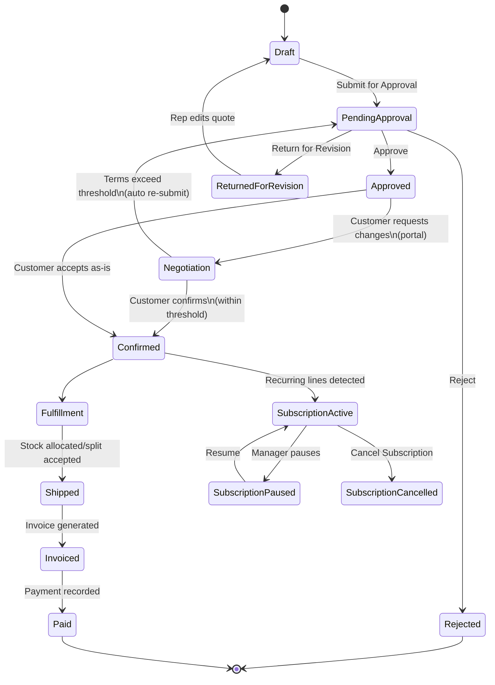

# DealFlow360 — Order Lifecycle Flow

Derived from the end-to-end product wireframe (Login → Payment). This document
describes the order/deal as a single object that moves through **quotation →
approval → (optional negotiation) → fulfillment → subscription/billing →
invoicing → payment**, with deal-health monitoring running alongside the
whole thing.

## 1. Actors

| Actor         | Access            | Screens                                                  |
| ------------- | ----------------- | -------------------------------------------------------- |
| Sales Rep     | Internal          | Dashboard, Quotations, Fulfillment (view), Subscriptions |
| Sales Manager | Internal          | Approvals (level 1), Deal Health                         |
| Finance       | Internal          | Approvals (level 2), Invoices, Billing                   |
| Warehouse/Ops | Internal          | Fulfillment                                              |
| Admin         | Internal          | Product Catalog, Discount Tier Setup, Reporting          |
| Customer      | External (portal) | Customer Portal (negotiation, invoices read-only)        |

## 2. High-level state machine

## 3. Stage-by-stage flow

### Stage 1 — Quote creation (Screens 2, 3, 4, 16–18)

1. Sales rep logs in (**Screen 1**) and lands on the **Sales Dashboard** (**Screen 2**), which surfaces pending approvals, open quotations, and at-risk deals.
2. Rep clicks **+ New Quotation** → **Quotations List** (**Screen 3**, kanban by status: Draft / Pending Approval / Approved / Negotiation / Confirmed).
3. Rep opens/creates a **Quotation Detail** (**Screen 4**): picks customer + price list, adds line items (product, qty, price, discount).
   - Every discount entry is validated **live**, against the **Discount Tier & Category ceilings** configured in **Screen 18**, not only at submit time.
   - Upsell/cross-sell suggestions are pulled from the **Product Catalog** (**Screens 16–17**).
4. Rep clicks **Save Draft** (stays in `Draft`) or **Submit for Approval** (→ `PendingApproval`, only if any line/blended discount exceeds tier or category ceiling — otherwise it can skip straight to `Confirmed`).

### Stage 2 — Approval routing (Screens 5, 6, 18)

1. Quotes needing approval land in the **Approvals List** (**Screen 5**), filterable by Pending / Returned / Approved, showing blended risk and current stage.
2. **Approval Detail** (**Screen 6**) shows:
   - Why the quote was flagged (per-line discount given vs. tier/category limit vs. over-by amount).
   - A stepper: `Submitted → Sales Manager → Finance → Confirmed`. Routing level is decided by the **blended risk score** computed from **Screen 18**'s escalation table (within-limit = no approval; medium risk = Sales Manager only; high risk = Sales Manager then Finance).
   - Full audit history (actor, action, date, note) — every approve/return/reject must be logged with user, timestamp, and reason.
3. Actions: **Approve** (advance stepper; if last required level, → `Approved`), **Return for Revision** (→ back to rep as `Draft`, with note), **Reject** (terminal).

### Stage 3 — Customer negotiation (Screen 11, loops back to Screen 6)

1. An `Approved` quote is visible to the customer in the **Customer Portal** (**Screen 11**: My Quotes / Messages / Profile).
2. Customer can comment per line (e.g. "can this be net 45?"), propose a **counter-discount %**, and a **requested delivery date**, then **Submit Request** or **Confirm Quotation** outright.
3. **Business rule:** if the customer's final negotiated terms still fit inside the approved thresholds, **Confirm Quotation** moves the deal straight to `Confirmed`. If the new terms exceed the threshold again, the quote **automatically re-enters approval** (back to Screen 6) rather than confirming.

### Stage 4 — Fulfillment (Screens 7, 8)

1. Once `Confirmed`, the order appears in **Orders Awaiting Fulfillment** on the **Fulfillment List** (**Screen 7**), alongside live stock-by-warehouse levels (in stock / reserved / available).
2. Opening an order shows **Fulfillment Detail** (**Screen 8**): a suggested warehouse split (ship-from, est. shipment qty, cost) when a single warehouse can't cover the full order.
3. Ops either **Accept Suggested Split** or **Manual Override**. If part of the order is backordered, a **"Consolidate Remaining Backorder"** prompt fires automatically once the short warehouse restocks.
4. When all lines are shipped, the order status advances to `Shipped`.

### Stage 5 — Subscriptions & recurring billing (Screens 9, 10)

1. Any recurring line on the original order (e.g. Care Plan, Support SLA) spins up a row in the **Subscriptions List** (**Screen 9**: Active / Paused / Cancelled), independent of the one-time order's fulfillment state.
2. **Billing Detail** (**Screen 10**) shows the subscription's originating **one-time lines** (for traceability) plus its **recurring lines** (plan, cycle, next bill date, amount).
3. Actions: **Modify Subscription** (change plan/cycle), **Cancel Subscription**. Admin can also add a **+ New Plan** directly from Screen 9.

### Stage 6 — Invoicing & payment (Screens 12, 13)

1. Shipment (one-time) and each billing cycle (recurring) generate an invoice, listed in **Invoices List** (**Screen 12**: Unpaid / Paid).
2. **Invoice Detail** (**Screen 13**) shows a stepper: `Order Confirmed → Shipped → Invoiced → Paid`, and a breakdown of invoice lines (shipping vs. recurring) with due dates.
3. Actions: **Record Payment** (→ `Paid`), **Send Reminder** (for unpaid, past-due invoices).
4. **Business rule:** partial deliveries produce partial invoices — the invoice is reconciled against what was actually shipped, not the full order.

### Cross-cutting — Deal health & reporting (Screens 14, 15)

- **Deal Health Dashboard** (**Screen 14**) continuously watches every open deal for: stalled deals (idle > N days), discount anomalies (line/blended discount far above average), and delivery slippage (overdue shipments) — each flaggable to **Escalate** or **Nudge Rep**.
- **Admin/Reporting Dashboard** (**Screen 15**) aggregates closed-loop metrics (quotes created, avg approval time, top upsell product) filterable by period/rep/status/product, exportable as PDF/XLS.
- **Product Catalog & Discount Config** (**Screens 16–18**) are the master-data screens that every stage above reads from (pricing, tax, variants, subscription cadence, discount ceilings, approval routing table) — they don't carry order state themselves, but every quote/approval/billing calculation depends on them.

## 4. Screen → Stage map

| #   | Screen                                | Stage                  |
| --- | ------------------------------------- | ---------------------- |
| 1   | Login/Signup                          | Entry                  |
| 2   | Sales Dashboard                       | Entry                  |
| 3   | Quotations List                       | 1. Quote creation      |
| 4   | Quotation Detail                      | 1. Quote creation      |
| 5   | Approvals List                        | 2. Approval            |
| 6   | Approval Detail                       | 2. Approval            |
| 7   | Fulfillment List                      | 4. Fulfillment         |
| 8   | Fulfillment Detail                    | 4. Fulfillment         |
| 9   | Subscriptions List                    | 5. Subscriptions       |
| 10  | Billing Detail                        | 5. Subscriptions       |
| 11  | Customer Portal                       | 3. Negotiation         |
| 12  | Invoices List                         | 6. Invoicing & payment |
| 13  | Invoice Detail                        | 6. Invoicing & payment |
| 14  | Deal Health Dashboard                 | Cross-cutting          |
| 15  | Admin/Reporting Dashboard             | Cross-cutting          |
| 16  | Product Catalog                       | Master data            |
| 17  | Product Detail                        | Master data            |
| 18  | Discount Tiers & Approval Chain Setup | Master data            |

See [API_DOCS.md](./API_DOCS.md) for the endpoint-level contract behind every screen above.
